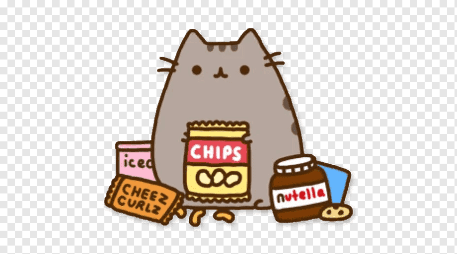
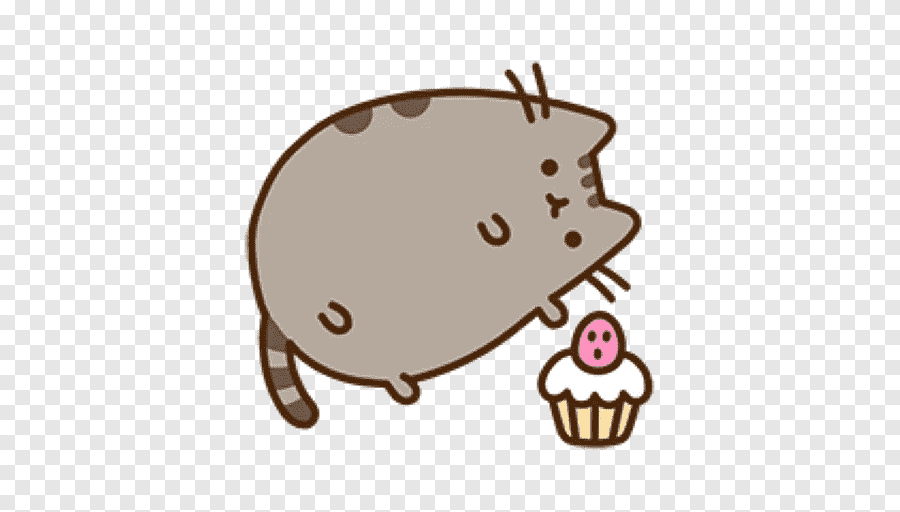
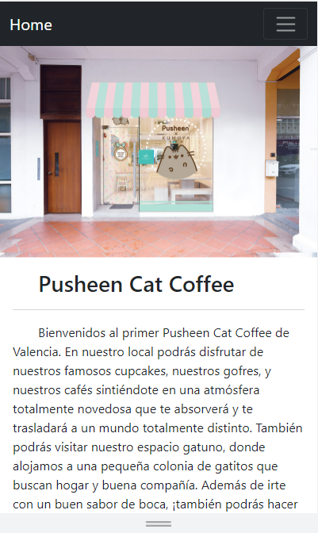
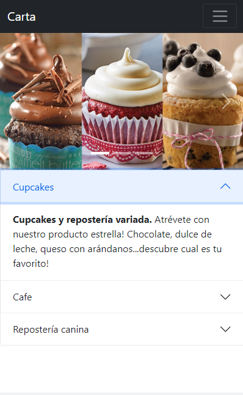
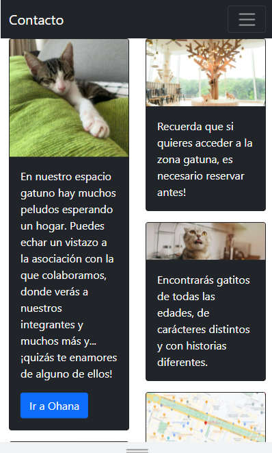

## Pusheen Cat Cafe

:wave: I'm Raquel Moya. 
:computer: I'm a FSD student at <kbd>⇥</kbd>  

### About the proyect
This proyect is a design of a web page made with Bootstrap.  
 
That's the "Home" page, which contains a nav bar with links to the other 2 pages.  
 
That's the "carta" page, which contains a nav bar with links to the other 2 pages, and a carousel with photos of products. We can see an accordion with descriptions of the products above. 
 
In "contacto" page, we can see a nav bar with links to the other 2 pages. There are some cards with information and photos. In two of them, we can click a button and go to another web to see more information about the cats or about the location.  
At the end of the page, you can see a dropdown where you can go to gmail to send us an email, you can go Instagram to follow us, and you can see the phone number to contact us.  

All the photos above are about the responsive view of the web. You can see more at https://raquelmoya.github.io/ProyectoBootstrap/

### Built with

For this, the following technologies have been used: 
 

 

### Credits

Author: RaquelMoya

Last edited on:
30/01/2022